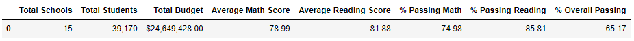
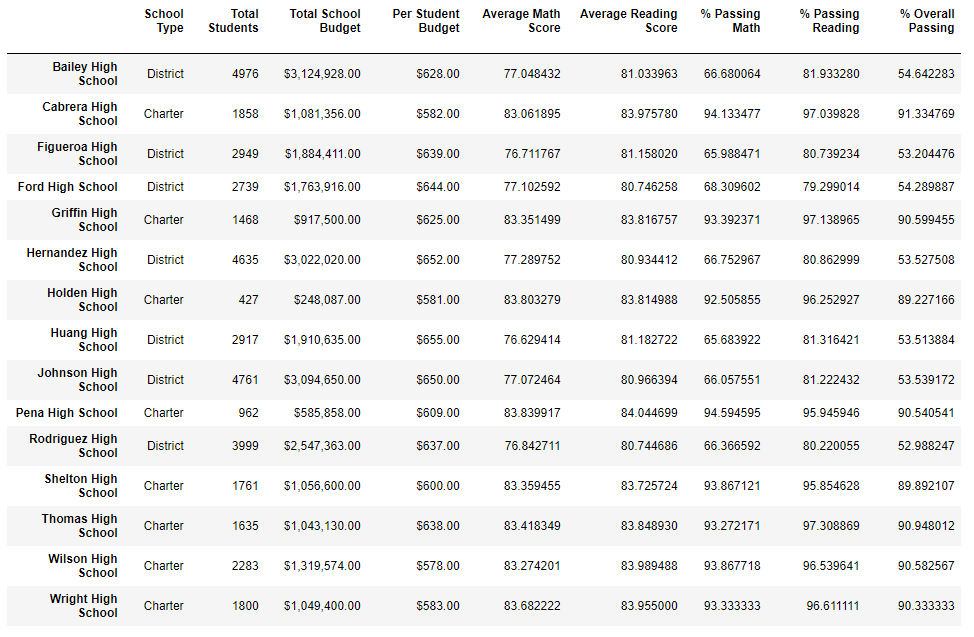
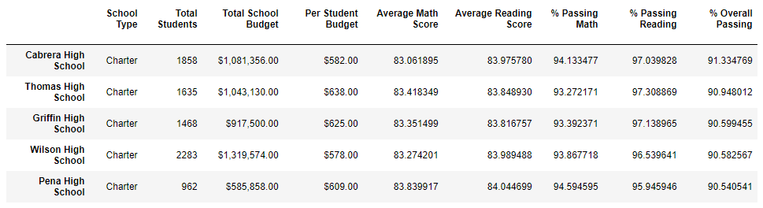
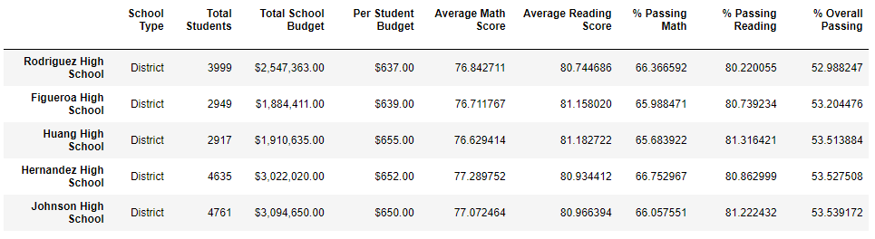
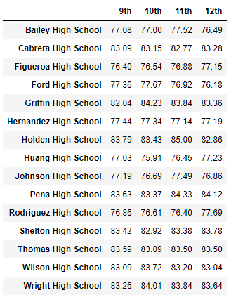
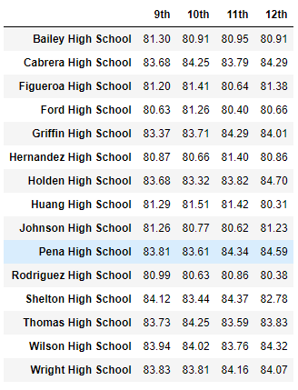
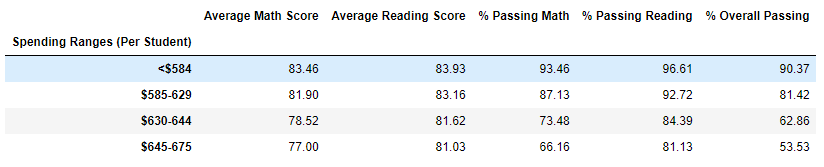
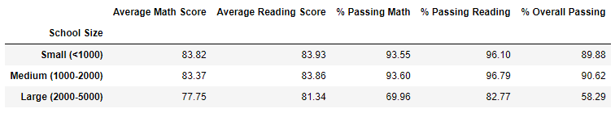
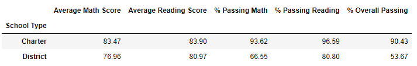

# Py City Schools

- **_Py City Schools_** - A [Juypter Notebook](PyCitySchools/PyCitySchools.ipynb) that analyzes the school and student records of the given district. The data provided will allow us to look at several factors which include student scores (reading and math), budgetary costs, school sizes, passing metrics, types of schools, scores by grades and top percentiles. We can summarize data in different ways and present some observations on what the data might be telling us.

## Files

- PyCitySchool Files

  - [School Data](PyCitySchools/Resources/schools_complete.csv) - Source file for the school data to be processed

  - [Student Data](PyCitySchools/Resources/students_complete.csv) - Source file for the student data to be processed

  - [`PyCitySchools.ipynb`](PyCitySchools/PyCitySchools.ipynb) - The Juypter Notebook for processing the [School Data](PyCitySchools/Resources/schools_complete.csv) and [Student Data](PyCitySchools/Resources/students_complete.csv)

## Results

All results can seen below, as well as, reviewed in the [Juypter Notebook](PyCitySchools/PyCitySchools.ipynb)

1. District Summary

   

1. School Summary

   

1. Top 5 Performing Schools

   

1. Bottom 5 Performing Schools

   

1. Math Scores by Grade

   

1. Reading Scores by Grade

   

1. Scores by School Spending

   

1. Scores by School Size

   

1. Scores by School Type

   

## Observations

1. Overall looking at the data Charter Schools have less students
1. Charter schools have higher math, reading and overall passing grades which is consistent with looking at the scores by school size
1. Per student budget doesn't appear to be an indicator of passing scores as lower per student spending has higher passing rates than those schools who spend more on a student (however there might be higher costs because of the sheer number of students, staff, teachers and facilities needed)
1. Not sure why (need more data) but it appears that passing grades for both math and reading don't vary more than ~2% grade year over grade year (9th, 10th, 11th, and 12th grades).

## Execution

1. The assumption is that you have a working Python 3.6, Jupyter Notebook 6.1.4 and Pandas 1.0.5
1. Clone the [`git repository`](https://github.com/jayhjman/pandas-challenge) for this project
1. Change into the [`repository directory`](https://github.com/jayhjman/pandas-challenge) and then into [`PyCitySchools`](PyCitySchools/)
1. Execute `jupyter notebook` via command line
1. Jupyer Notbook will open and once it does, select the file [`PyCitySchools.ipynb`](PyCitySchools/PyCitySchools.ipynb)
1. This will execute against the `csv` files found in [School Data](PyCitySchools/Resources/schools_complete.csv) and [Student Data](PyCitySchools/Resources/students_complete.csv) under `Resources` directory
1. Please execute `Kernal > Restart & Run All` from the Jupyter Notebook menu to see the results

## Notes

For some reason when you preview [`PyCitySchools.ipynb`](PyCitySchools/PyCitySchools.ipynb) github is messing up the table formatting, please view this in Jupyter Notebook to see the correct table structure

## Author

Made by Jay with :heart: in 2020.
